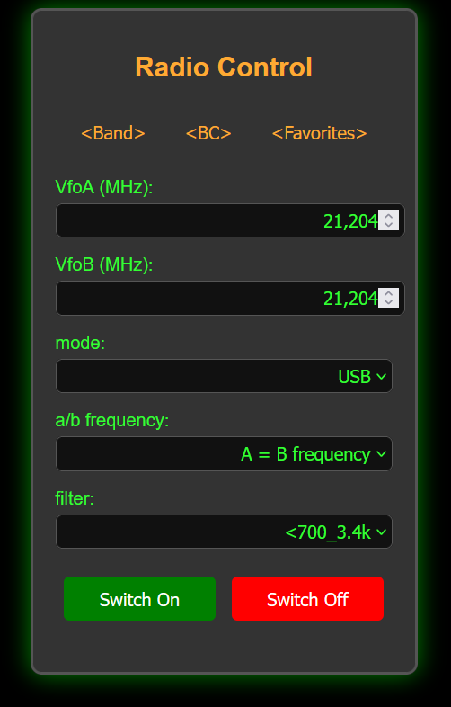
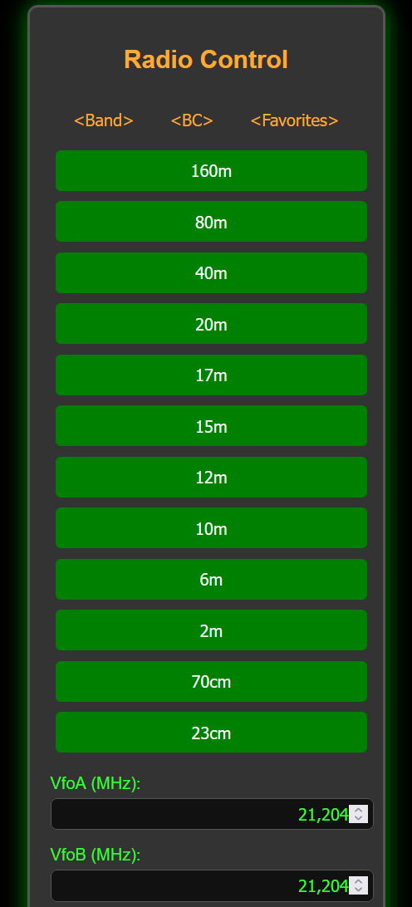

# HS2/QR20/Q900 ESP32 Web Controller

## Overview

This project aims to develop a Bluetooth controller for the Ailunce HS2/Radioddity QR20/Q900 SDR transceiver device using an ESP32 microcontroller. The ESP32 provides Wi-Fi and Bluetooth connectivity, allowing users to control the device remotely. The controller has a web-based interface for easy access.

 **The project is intended to serve as an example application for an easy introduction to the control possibilities of the transceiver and to encourage users to develop their own applications.**



## Features

- **Favorites**: Save and recall favorite frequencies and settings.
- **Web Interface**: Access and control the device through a web-based interface.
- **Bluetooth Support**: Control the transceiver device using Bluetooth.
- **RESTful API**: Communicate with the ESP32 controller using a RESTful API.
- **OTA Updates**: Support for Over-The-Air (OTA) firmware updates.

## Getting Started

### Prerequisites

- ESP32 development board with 16MB of flash memory like firebeetle ESP32 [https://www.dfrobot.com/product-1590.html](https://www.dfrobot.com/product-1590.html)
- USB cable for programming
- MS Visual Studio Code with PlatformIO extension
- HS2/QR20/Q900 device

### Installation

1. **Clone the Repository**:

    ```sh
    git clone https://github.com/norman-de/q900_esp32_controller.git
    cd q900_esp32_controller
    ```

2. **Configure the Project**:
    Open the project in Visual Studio Code and modify the `config.h` file to set up your Wi-Fi credentials and other configuration parameters.

3. **Upload the Code**:
    Connect your ESP32 board to your computer and upload the code using the PlatformIO extension.

4. **Access the Web Interface**:
    Once the code is uploaded, you can access the web interface by navigating to the IP address of your ESP32 in a web browser.

## Favorites Feature

The favorites function allows users to save and recall their favorite frequencies and settings. The function is accessible via the web interface and provides a convenient way to switch between different frequencies and configurations. To edit the favorites, go to the src\html.h file and edit the buttons in the favorites section (Starts from line 93). The buttons are defined as follows:

```html
    <button onclick="setFavorite(VFOA_Frequency, VFOB_Frequency, Mode, Filter_Bandwidth)">Favorite Name</button>
```



## API Endpoints

The web interface communicates with the ESP32 control unit via a RESTful API. Below you will find the details of the available API endpoints:

### /getstatus

- **Description**: Retrieves the current status of the device.
- **Method**: GET
- **Response**: JSON object containing the status information.
- **Example Response**:
  
    ```json
    {
        "Transceiver_Status": 0,
        "VFOA_Mode": 0,
        "VFOB_Mode": 0,
        "VFOA_Frequency": 21204000,
        "VFOB_Frequency": 21204000,
        "A_B": 0,
        "NR_NB": 1,
        "RXT": 60,
        "XIT": 60,
        "Filter_Bandwidth": 39,
        "Spectrum_Bandwidth": 0,
        "Voltage": 8.50,
        "UTC_Time": "13:16:54",
        "Status_Bar": 27,
        "S_Table": 1,
        "PO_Table": 128,
        "SWR_AUD_ALC": 0
    }
    ```


### /off

- **Description**: Turns off the device.
- **Method**: GET
- **Response**: Confirmation message indicating the device has been turned off.

### /on

- **Description**: Turns on the device.
- **Method**: GET
- **Response**: Confirmation message indicating the device has been turned on.

### /mode?modeA=`0-8`&modeB=`0-8`

- **Description**: Sets the operating mode of the device.
- **Method**: GET
- **Response**: Confirmation message indicating the mode has been set.

### /abFrequency?ab=`0-2`

- **Description**: Adjusts the A/B frequency of the device.
- **Method**: GET
- **Response**: Confirmation message indicating the frequency has been adjusted.

### /filter?filter=`1-86`

- **Description**: Applies a filter to the device.
- **Method**: GET
- **Response**: Confirmation message indicating the filter has been applied.

### /preamplifier?amp=`0-1`

- **Description**: Configures the preamplifier settings.
- **Method**: GET
- **Response**: Confirmation message indicating the preamplifier settings have been configured.
